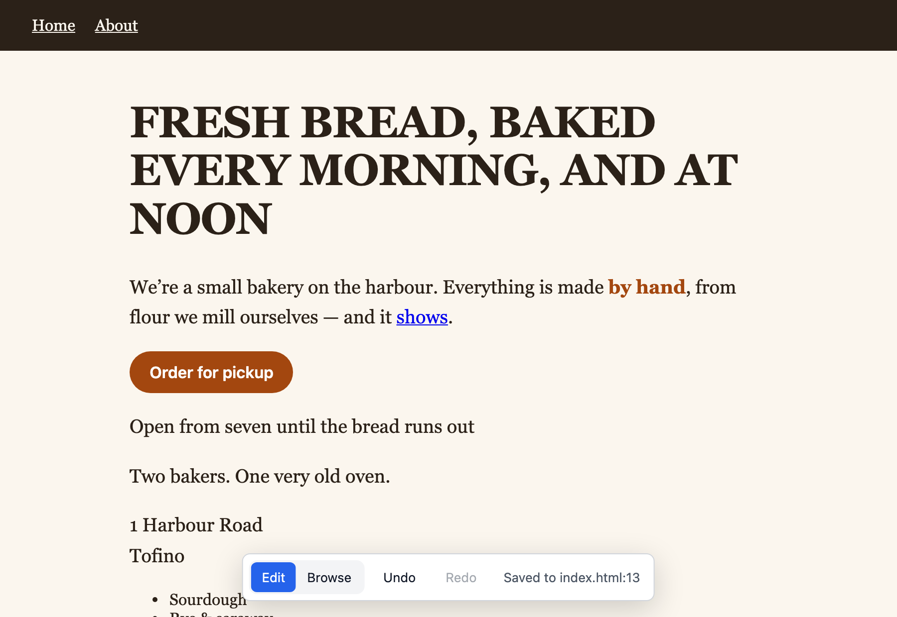
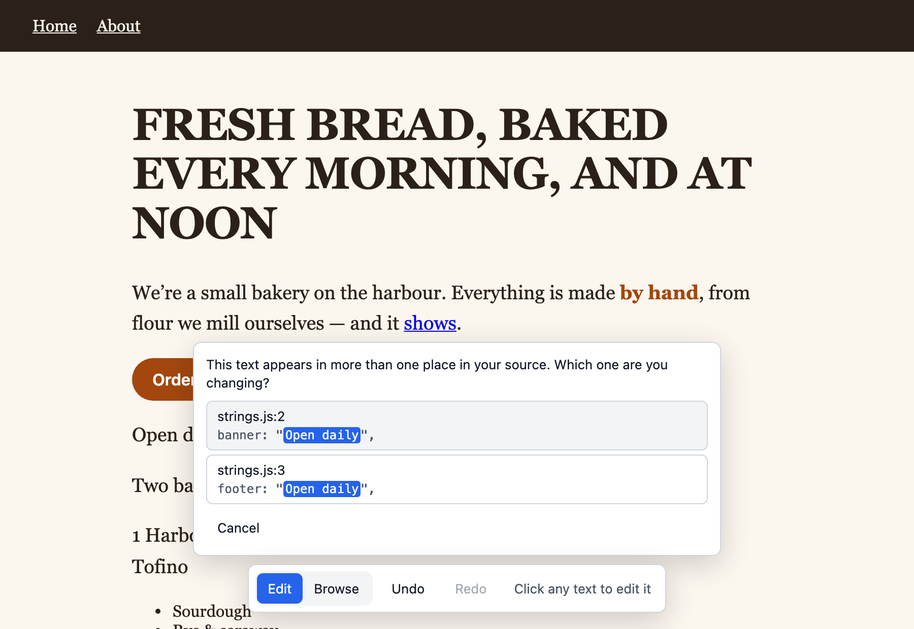

# Editing guide

Editdesk adds a toolbar to the bottom of every page it opens. The toolbar has two modes, **Edit** and **Browse**, the **Undo** and **Redo** buttons, and a status line. Pages open in **Edit**.

## Editing text

1. Move the pointer over the page. A dashed outline shows the text a click will edit
2. Click the text. The outline turns solid and the caret appears where you clicked
3. Type. The text stays in the page's own font, size, colour and wrapping
4. Press Enter, or click anywhere else, to save

Press Esc to put the text back as it was.



The status line shows where the edit went, for example `Saved to index.html:12`. The same line is printed in the terminal.

A few things to know:

- Double-click a word to select it, as in any editor
- Clicking text inside a paragraph edits the whole paragraph, including its bold text and links
- Bold, links and other formatting cannot be added or removed. A selection that reaches across formatting cannot be deleted or typed over. Select the text on one side of the formatting at a time
- Pasted text arrives as plain text
- Spelling is checked while you type, by the browser
- Text in form fields, images and charts cannot be edited

## New lines and paragraphs

Press Shift+Enter for a new line. Press it twice in a row for a new paragraph. To remove either, put the caret after it and press Backspace.

What is written depends on where the text lives:

- **In a page's own HTML file**, a new line is a `<br>` tag. A new paragraph splits a `<p>` or `<li>` in two. The second one gets the same class and other attributes, without the `id`. In any other element, such as a heading or a button, a new paragraph is two new lines
- **In an app's source**, a new line in text between tags is a `<br />` tag. A new line in a string is `\n`, and is saved only when the page shows line breaks in that text (the element's `white-space` style is `pre`, `pre-wrap`, `pre-line` or `break-spaces`). Otherwise the line break would not appear, so Editdesk puts the text back and says so. A new paragraph is two new lines

The spaces on either side of a new line are removed. After a paragraph is split or joined, and after a new line is saved to an app's source, the page loads again so it matches the file.

## Undo and redo

**Undo** puts the file back as it was before the latest saved edit, and the page with it. **Redo** applies the edit again. They cover every edit saved since Editdesk was started, on any page, newest first. Undo is refused when something else has changed the file since the edit. While you are typing, the keyboard undo shortcut works on your typing as usual, except for new lines.

## Using the page while editing

In **Edit**, links do not navigate and buttons do nothing, so you can click them to edit their labels. To open a menu, change a tab or go to another page, click **Browse**, use the page, then click **Edit**. The mode is kept when you move to another page.

## When the text is in more than one place

Pages rendered by an app keep their copy in source files. When the text you edited appears more than once in those files, Editdesk asks which one you mean and shows each place with its file, line and surrounding code.



Click the right place to save there. Click **Cancel**, or start another edit, to put the text back. Places in the app's own source are listed before its tests and documents.

Editdesk asks the same way before it changes text that is only part of a longer string.

## Live sites

Open any site by its address:

```bash
editdesk https://example.com/pricing
```

A live site has no files to save to. Edits change the page in your browser, and the toolbar shows **Copy changes**. Click it to copy a list of each old and new wording, grouped by page, to send to whoever can change the site.

## When an edit is not saved

Editdesk puts the old text back and explains why. Each message is covered in [When an edit is not saved](troubleshooting.md).
