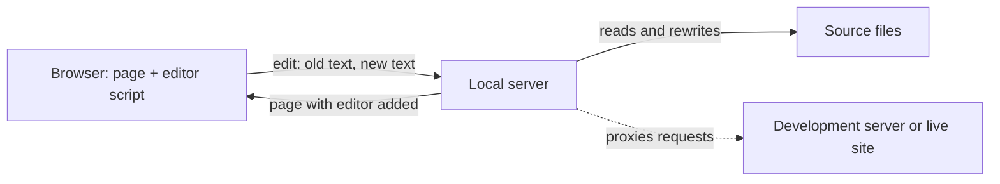

# How it works

Editdesk is a local server and a script it adds to every page. The script makes text editable in place and sends each change to the server. The server writes the change into the source file.

## Parts

| Part           | What it does                                                                                                | Where it lives |
| -------------- | ----------------------------------------------------------------------------------------------------------- | -------------- |
| Command line   | Reads the target and options, starts the server, opens the browser                                          | `src/cli/`     |
| Server         | Serves a folder or proxies another server, adds the editor to HTML pages, accepts edits                     | `src/server/`  |
| Source editing | Finds where text lives in a file and rewrites only that range                                               | `src/source/`  |
| Editor         | Runs in the page: editing sessions, toolbar, undo history, change list                                      | `src/client/`  |
| Messages       | Every sentence a person reads. The editor's are in `src/client/strings.js`, all others in `src/messages.js` |                |

Dependencies point one way: the command line uses the server, the server uses source editing, and source editing uses nothing else in the project. The editor shares no code with the server. The names they both need, such as the token header, reach the editor in a configuration block the server puts in the page.

## Editing in place

The editor sets `contenteditable="plaintext-only"` on the clicked element and removes it when the edit ends. The element keeps every style it had, which is why the text looks the same while it is edited. The toolbar lives in a shadow root, so page styles and toolbar styles cannot affect each other. The only styles added to the page are two outlines.

Only text may change. The editor refuses input that would add or remove an element, and handles two cases by hand where browsers would otherwise restructure the page:

- Typing over or deleting all the text of a bold or a link would remove the element. The editor changes the text and keeps the element
- Typing at the very start or end of a link would put the text outside the link. The editor inserts it inside. The keyboard undo shortcut does not cover text inserted this way, or new lines

After each input the editor checks that the elements under the edited one are the same elements in the same order. If not, it puts the last good state back.

## Slots

Text is addressed by slot. An element's slots are the gaps before, between and after its child elements and comments. `
Hello <b>big</b> world
` has two slots in `p`, holding `Hello ` and ` world`, and one in `b`. A slot exists even when it is empty, so it always has a position.

The editor and the server divide elements the same way, so "slot 1 of element 12" names the same place in the page and in the file.

A ` ` tag with no attributes is part of the text, not a divider. Inside an edit, a line break travels as the Unicode line separator (U+2028) and a paragraph break as the paragraph separator (U+2029). Ordinary copy never contains them. Each writer turns them into its own spelling: ` `, ` `, `\n`, or the end and start tags that split a paragraph.

## Saving to an HTML file

1. When the server sends an HTML file to the browser, it parses the file with [parse5](https://github.com/inikulin/parse5), which reports the position of every tag. It adds a `data-editdesk-el` number to each element whose text maps exactly to the file. The file on disk is not changed.
2. An edit names the element number, the slot, the old text and the new text.
3. The server parses the file again, finds that slot and checks that it still shows the old text. If it does, the server rewrites that range.

Inside the range, only the characters that differ are replaced. The raw text is split into units, one per character, entity or line ending. Units outside the changed part are copied as they were, which keeps `&mdash;`, `&nbsp;` and Windows line endings intact.

An element is left without a number when its text does not map exactly, for example when the parser moved loose text out of a table. Such text falls through to the search.

## Saving by search

When there is no HTML file for the page, or the slot does not match, the server searches the root folder for the old text. The [command reference](reference.md#where-an-edit-is-saved) lists how each kind of match is treated. A match is rewritten word by word: words the edit did not change keep their original spelling and line wrapping.

## Undo and redo

The server remembers the contents of the file before and after each saved edit, for the latest 200 edits. **Undo** writes the earlier contents back, and only when the file still holds exactly what the edit left. This works the same for every kind of edit, and survives the page loading again. The history is kept in memory and ends when Editdesk stops.

## Decisions

**A local server, not a browser extension or a browser-only page.** Writing to files from a page needs the File System Access API, which MDN lists as experimental with limited availability, and a page opened that way loses its relative stylesheets and images. A server works in every browser and serves the whole folder.

**Edits rewrite source text and never save the browser's version of the page.** The browser's version has been changed by scripts and would be reformatted on the way out.

**Text is never guessed at.** An edit is saved only when the old text is found in exactly one certain place, or the person picks the place.

**No build step.** The project is plain JavaScript modules, checked with TypeScript through JSDoc comments, so the code that is tested is the code that runs.

## Security

The server can write files, so it accepts requests only from pages it served.

| Measure                                                                                                                                                                        | What it stops                                                                       |
| ------------------------------------------------------------------------------------------------------------------------------------------------------------------------------ | ----------------------------------------------------------------------------------- |
| Listens on `127.0.0.1` only                                                                                                                                                    | Other computers on the network reaching it                                          |
| Refuses any `Host` header other than `localhost`, `127.0.0.1` or `[::1]` with its own port                                                                                     | DNS rebinding, where a web page reaches a local server through a name it controls   |
| Requires a random token, created at startup, in the `x-editdesk-token` header of every edit                                                                                    | Other web pages sending edits. They cannot read the token                           |
| Requires `application/json` and refuses a foreign `Origin`                                                                                                                     | Cross-site form posts                                                               |
| Resolves every path to its real location and refuses anything outside the root, and any name starting with a dot                                                               | Reading or writing through `..` or symbolic links, and reading files such as `.env` |
| Writes only by replacing text it has found in an existing source file                                                                                                          | Creating files, or writing arbitrary content                                        |
| Typed text is encoded for the place it is written: a JavaScript string, an attribute value, or text between tags. Anywhere else, only plain words and punctuation are accepted | Typed `<script>`, backticks, `${}` or `{{ }}` becoming markup or code               |
| WebSocket connections are accepted only from pages Editdesk served                                                                                                             | Another site reaching the proxied server through Editdesk                           |

When Editdesk proxies a site, it removes the `Content-Security-Policy` header from HTML pages so the editor can load, and removes `Secure` and `Domain` from cookies so they work on `localhost`. Scripts on a page Editdesk serves can read the token, as the editor does. Open only sites you trust.
