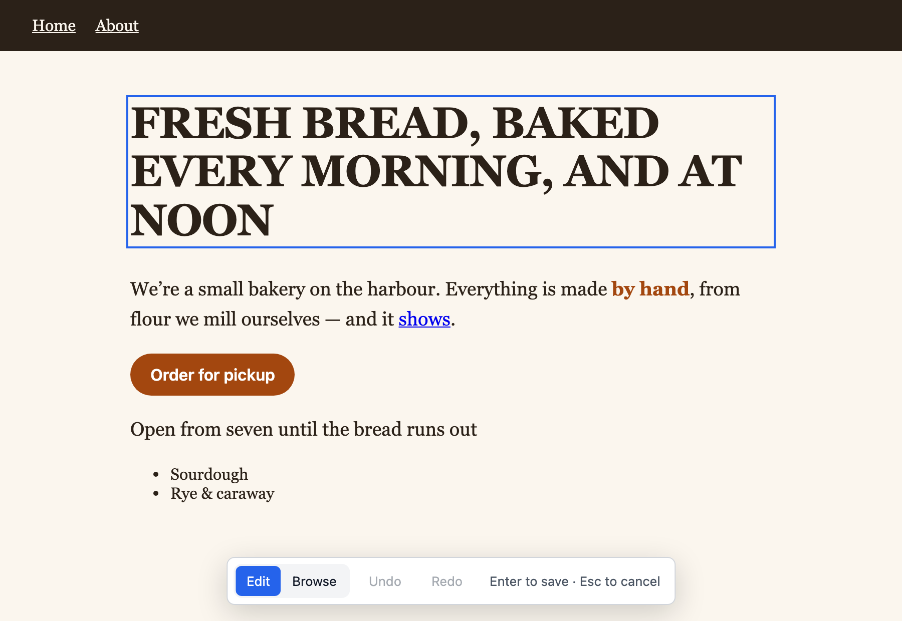

# Editdesk

Editdesk lets you change the words on a web page by clicking them and typing, then saves the change to the source file. The text keeps its font, size and layout while you edit. No AI is involved, so an edit costs nothing.



## Start

1. Install [Node.js](https://nodejs.org) 20.19 or newer.
2. Open a page:

   ```bash
   npx github:Up-Coast/editdesk page.html
   ```

3. Click any text and type.
4. Press Enter to save.

## Pages

- [Editing guide](editing.md): everything the editor does
- [Command reference](reference.md): targets, options, and which files are read and written
- [When an edit is not saved](troubleshooting.md): each message and what to do
- [How it works](how-it-works.md): the design, the modules and the security model
